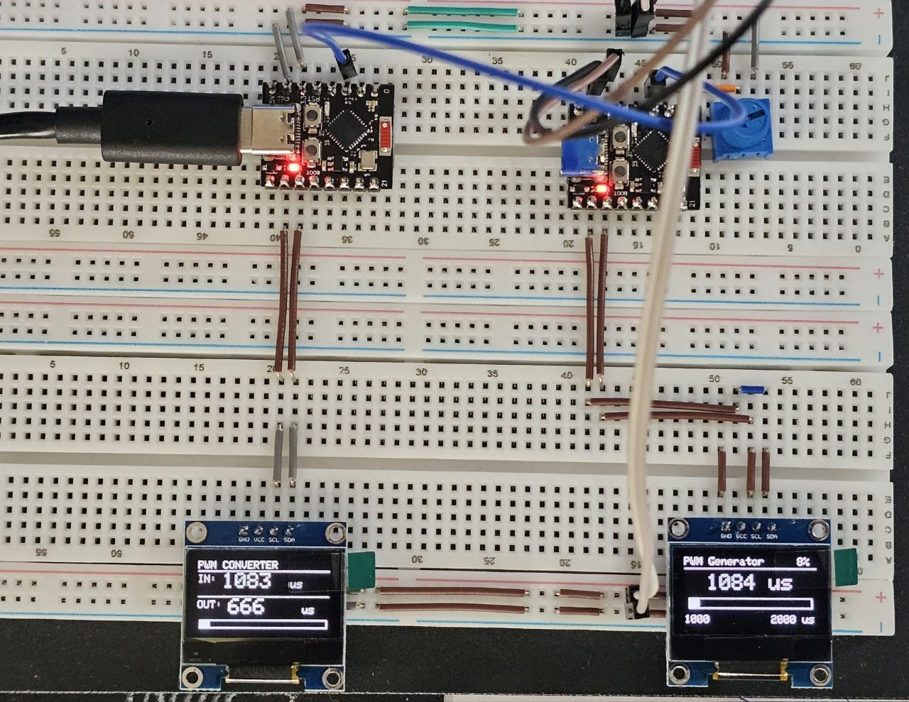

# PWM Converter

Конвертер диапазона PWM-сигнала на базе **ESP32-C3 Super Mini** с отображением входного и выходного значений на OLED-дисплее SSD1306.

Преобразует стандартный RC-диапазон 1000–2000 мкс в расширенный диапазон 500–2500 мкс (подходит для цифровых сервоприводов с широким диапазоном).



## Характеристики

| Параметр | Значение |
|---|---|
| МК | ESP32-C3 Super Mini |
| Вход PWM | 1000–2000 мкс |
| Выход PWM | 500–2500 мкс |
| Частота выходного PWM | 50 Гц |
| Разрешение LEDC | 14 бит |
| Дисплей | SSD1306 128×64 (I2C, 0x3C) |
| Частота обновления | ~20 Гц |

## Пины

| Функция | GPIO |
|---|---|
| PWM вход | GPIO 2 |
| PWM выход | GPIO 3 |
| I2C SDA (дисплей) | GPIO 7 |
| I2C SCL (дисплей) | GPIO 6 |

## Принцип работы

1. Входной PWM-сигнал измеряется аппаратным прерыванием (`CHANGE`) — фиксируется время переднего и заднего фронта.
2. Ширина импульса линейно пересчитывается из диапазона IN → OUT.
3. Выходной сигнал формируется через ESP-IDF LEDC (14-битный таймер, 50 Гц).
4. Дисплей обновляется ~20 раз в секунду: отображаются IN/OUT значения в мкс и прогресс-бар выхода.

## Зависимости

- [Adafruit SSD1306](https://github.com/adafruit/Adafruit_SSD1306) `^2.5.7`
- [Adafruit GFX Library](https://github.com/adafruit/Adafruit-GFX-Library) `^1.11.9`

## Сборка и прошивка

Проект использует [PlatformIO](https://platformio.org/).

```bash
pio run --target upload
pio device monitor
```

Скорость монитора: **115200** бод.

